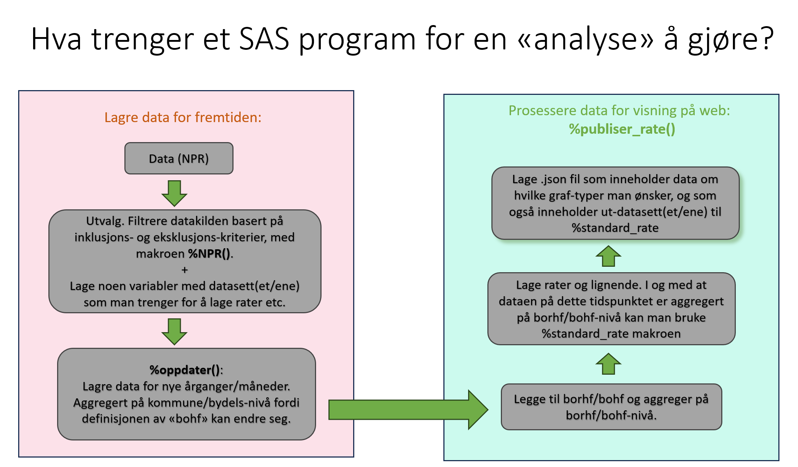

# Mappestruktur

## Mappen "analyser"
I denne mappen ligger alle SAS-filene som genererer de ulike "analyseboksene". For hver analyse/analyseboks lages det en mappe og hver mappe inneholder en SAS-fil.
Mappen skal ha navn som identifiserer den aktuelle analysen, og SAS-filen inni mappen skal ha samme navn.

Pr. 19 november 2024 finnes følgende mapper/analyser:
- endometriose
- fremfall
- injeksj_kont
- injeksj_pas
- tonsiller_barn
- tonsiller_voksne

Inni SAS-filen samles både tekstelementer til analyseboksen:
- diskusjon,
- informasjon/utvalg,
- labels,
- aksetekster osv.
  
og all kode som produserer data/figurer:
- utvalg,
- oppdeling ved flerdelt søyle,
- aggregering,
- rateprogram,
- produksjon av jsonfil,
- figurproduksjon for skriving/analyse

Følgende makroer anvendes for å lage data til analyseboksen:
- npr
- beh_eget_annet_priv (som regel)
- oppdater
- publiser_rate

De analysespesifikke SAS-filene i mappen "analyser" skal ha egen dokumentasjon som består av informasjon om:
- hvem som sist gjennomførte analysen
- eventuelle endringer i utvalgskoder

Figurer som lages til bruk i analyse/skriveprosessen skal lagres på Q i mappen oppdaterte_analyser/Figurer.

## Mappen "figurmakroer"
I denne mappen samles alle figurermakroer som brukes i analyse/skriveprosessen. Følgende 5 makroer brukes:
- total_figurer
- panelfigur_todelt
- panelfigur_tredelt
- rate_alder_kjonn
- dim_rate_alder_kjonn

### total_figurer
Denne lager følgende 6 figurer:
- Panelfigur, rater totalt: &tema._panel_total
- Panelfigur, aldersprofil pr år: &tema._aldersprofil_aar
- Aldersprofil pr kjønn: &tema._aldersprofil
- Snittalder over tid pr kjønn: &tema._snittalder
- Antall over tid pr kjønn: &tema._antall_kjonn
- Forholdstall: &tema._forholdstall

### panelfigur_todelt
panelfigur_todelt(dim1=,dim2=,dimensjon=)
dim1 og dim2 er variabelene man ønsker å se spesifikt på
dimensjon er hva dim1 og dim2 viser

Makroen brukes i oppdaterte analyser.
Makroen lager 6 figurer:
- Panelfigur, rater dim1: &tema._panel_&dim1
- Panelfigur, rater dim2: &tema._panel_&dim2
- Todelt søylediagram første år: &tema._&dimensjon._andel&startaar.rate
- Todelt søylediagram siste år: &tema._&dimensjon._andel&sluttaar.rate
- Todelt søylediagram snitt i perioden: &tema._&dimensjon._andel_snitt_rate
- Antall over tid pr dim: &tema._antall_&dimensjon

### panelfigur_tredelt
panelfigur_tredelt(dim1=,dim2=,dim3=,dimensjon=)
dim1, dim2 og dim3 er variabelene man ønsker å se spesifikt på
dimensjon er hva dim1-3

Makroen brukes i oppdaterte analyser.
Makroen lager 7 figurer:
- Panelfigur, rater dim1: &tema._panel_&dim1
- Panelfigur, rater dim2: &tema._panel_&dim2
- Panelfigur, rater dim3: &tema._panel_&dim3
- Tredelt søylediagram første år: &tema._&dimensjon._andel&startaar.rate
- Tredelt søylediagram siste år: &tema._&dimensjon._andel&sluttaar.rate
- Tredelt søylediagram snitt i perioden: &tema._&dimensjon._andel_snitt_rate
- Antall over tid pr dim: &tema._antall_&dimensjon

### rate_alder_kjonn
rate_alder_kjonn(aarmin=&startaar,aarmax=&sluttaar,aldermin=16,aldermax=55,kjonn=0)
Aldersspennet må defineres. Dersom kun menn eller kun kvinner, kjonn lik 1 eller 0. Hvis begge kjønn skal kjonn være tom.

Makroen lager 4 figurer
- Ratefigur, rater totalt pr alder, fordelt på kjønn: &tema._rate_alder_kjonn
- Rate- og antallsfigur, totalt pr alder, fordelt på kjønn: &tema._rate_alder_kjonn2
- Rate- og antallsfigur, totalt pr år, fordelt på kjønn: &tema._rate_aar_kjonn2

### dim_rate_alder_kjonn
I utgangspunktet lik som rate_alder_kjonn, men rate_alder_kjonn lager figurer på totalen og dim_rate_alder_kjonn lager figurer på spesifisert dimensjon.

dim_rate_alder_kjonn(dim=endo_hyst,aarmin=&startaar,aarmax=&sluttaar,aldermin=16,aldermax=55,kjonn=0)
dim er variabelen man ønsker å se spesifikt på.
Aldersspennet må defineres. Dersom kun menn eller kun kvinner, kjonn lik 1 eller 0. Hvis begge kjønn skal kjonn være tom.

Makroen lager 4 figurer
- Ratefigur, rater totalt pr alder, fordelt på kjønn: &tema._&dim._rate_alder_kjonn
- Rate- og antallsfigur, totalt pr alder, fordelt på kjønn: &tema._&dim._rate_alder_kjonn2
- Rate- og antallsfigur, totalt pr år, fordelt på kjønn: &tema._&dim._rate_aar_kjonn2
- Snittalder i perioden, pr år, fordelt på kjønn: &tema._&dim._snittalder

## Mappen "makroer"
I denne mappen samles alle makroer som brukes i **produksjonen av data og tekst som skal inn i jsonfilen** og til nettsiden. Dette bildet forklarer hovedpoenget med hva disse makroene gjør:

